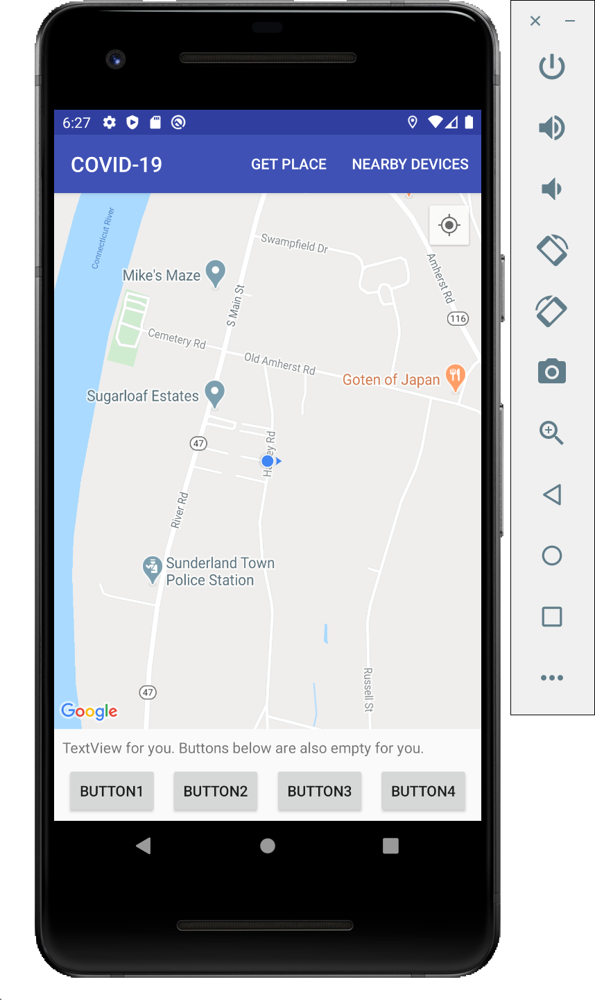

COVID-19 Social Distancing Application Code Base Guide
=====================================================

This sample goes hand in hand with a tutorial for the Google Maps Android API:
[Select Current Place and Show Details on a Map](https://developers.google.com/maps/documentation/android-api/current-place-tutorial).

Prerequisites
--------------

- Android SDK v24
- Latest Android Build Tools
- Android Support Repository
- Google Map API

## Overview

The code base contains a basic Google Map View, localization function, and a bluetooth devices scanning function. You can get your current location and show it on the map, as well as start a scanning process of bluetooth devices nearby and return the devices number.

When you click "Get Place" option on the menu bar, the longitude, latitude, place name as well as the address will be automatically saved in the variables: markerLatLng, markerSnippet, markerPlaceName. You can find them at the top of the `MapsActivityCurrent.java` file.

When you click on the "Devices Nearby" option, you will see another view and you can return the devices number to  `MapsActivityCurrent.java` file, or return the MAC address of a certain device if you select one in the list.

Also, you can customize the return value, like you can return a list of all these devices. Another thing you need to do is to filter the device type. There are many IoT devices other than smart phones, you need to decide which type of device to count in. You can find the full device type list in the reference link.

## Attention

1. Remember to apply for a **Google Map API Key** [(click this link to apply)](https://developers.google.com/maps/gmp-get-started) and copy your key into file `gradle.properties` file in your root folder. Replace the value in the line `GOOGLE_MAPS_API_KEY=INPUT_YOUR_API_KEY` by your key string. **OR YOU CAN NOT USE THE MAP**.
 
2. If you want to change the main UI or any functionalities, feel free to do that as long as you can make sure the tasks required can be finished.

3. All important tasks left for you are wrapped with `\\\\\\\\\\\\\\\\\\\\\\\\\\\`, search them and try to understand the code, as well as implement your own ideas.

4. The button and TextView in the bottom is empty. They are not binded or given any function. They are left for you to implement whatever function you like.

## Reference

1. [Android Bluetooth Overview: Official Bluetooth Guide](https://developer.android.com/guide/topics/connectivity/bluetooth)
2. [Android-BluetoothChat: Official Sample Code Here For Bluetooth](https://github.com/googlearchive/android-BluetoothChat)
3. [Android Build location-aware apps: Official User Location Guide](https://developer.android.com/training/location)
4. [Android Location Samples: Official Sample Code For User Location](https://github.com/android/location-samples)
5. [Android Google Map Guide](https://developers.google.com/maps/documentation/android-sdk/current-place-tutorial)
6. [Android Bluetooth Devices Type Full Table](https://developer.android.com/reference/android/bluetooth/BluetoothClass.Device)

Support
-------

- Stack Overflow: https://stackoverflow.com/questions/tagged/android+google-maps

If you have discovered an issue with the Google Maps Android API v2, please see
the resources here: https://developers.google.com/maps/documentation/android-api/support

If you've found an error in these samples, please file an issue:
https://github.com/googlemaps/android-samples/issues

License
-------

Please refer to the [LICENSE](https://github.com/googlemaps/android-samples/blob/master/LICENSE) at the root of this repo.
